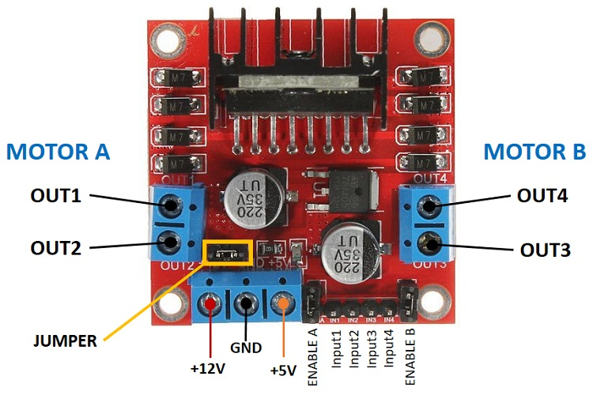
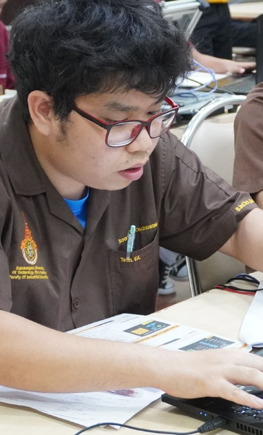

# 🚗 RMUTP_CARBOT
# (Arduino Library สำหรับรถ 2 ล้อ ESP32)

**RMUTP_CARBOT** 
เป็นไลบรารี Arduino สำหรับควบคุมรถยนต์ 2 ล้อ (2WD Robot Car) โดยใช้ ESP32 และไดร์เวอร์มอเตอร์ เช่น L298N

ออกแบบให้ใช้งานง่าย ควบคุมได้ทั้ง:

* วิ่งหน้า / ถอยหลัง
* เลี้ยว
* หมุนอยู่กับที่
* ปรับความเร็วด้วย PWM


<p align="center">
  
</p>
---

# ✨ คุณสมบัติ (Features)

* ควบคุมล้อซ้าย–ขวาแยกอิสระ
* เดินหน้า / ถอยหลัง / หยุด
* เลี้ยว (Soft Turn / Spin Turn)
* ปรับความเร็ว (0–100%)
* ใช้ PWM ของ ESP32 (LEDC)

---

# ⚙️ รองรับ (Compatibility)

* ✅ ESP32 เท่านั้น
* ❌ ไม่รองรับ Arduino UNO / Mega

---

# 🔌 การต่อวงจร (ESP32 + L298N)

```plaintext
ESP32            L298N
----------------------------
GPIO12 (ENA)  →  ENA (PWM ซ้าย)
GPIO14 (IN1)  →  IN1
GPIO27 (IN2)  →  IN2


GPIO26 (IN3)  →  IN3
GPIO25 (IN4)  →  IN4
GPIO33 (ENB)  →  ENB (PWM ขวา)

GND           →  GND (ต้องร่วมกัน)
```

---

# 🧠 หลักการทำงาน (สำคัญมาก)

อ้างอิงจากบทความ:
👉 ESP32 + L298N ควบคุมมอเตอร์ ([Random Nerd Tutorials][1])

## 🔹 1. ขา Enable (ENA / ENB)

* ใช้ควบคุม “ความเร็ว”
* ส่ง PWM → คุมความเร็ว
* ค่า Duty Cycle มาก = เร็ว

👉 “ความเร็วแปรตาม duty cycle ของ PWM” ([Random Nerd Tutorials][1])

---

## 🔹 2. ขา IN1-IN4 (ควบคุมทิศทาง)

### มอเตอร์ 1 (ซ้าย)

| IN1 | IN2 | ผล       |
| --- | --- | -------- |
| 0   | 1   | เดินหน้า |
| 1   | 0   | ถอยหลัง  |
| 0   | 0   | หยุด     |

### มอเตอร์ 2 (ขวา)

| IN3 | IN4 | ผล       |
| --- | --- | -------- |
| 0   | 1   | เดินหน้า |
| 1   | 0   | ถอยหลัง  |

👉 “LOW/HIGH ใช้กำหนดทิศหมุนของมอเตอร์” ([Random Nerd Tutorials][1])

---

# 🚀 การใช้งาน

## 📌 Include Library

```cpp
#include <RMUTP_CARBOT.h>
```

---

## 📌 กำหนดขา

```cpp
const int ENA = 12;
const int IN1 = 14;
const int IN2 = 27;
const int IN3 = 26;
const int IN4 = 25;
const int ENB = 33;
```

---

## 📌 สร้าง Object

```cpp
RMUTP_CARBOT car(ENA, IN1, IN2, ENB, IN3, IN4);
```

---

## 📌 เริ่มต้นระบบ

```cpp
car.begin(freq, resolution, pwmChannelA, pwmChannelB);

= ตั้งค่า PWM ให้ ESP32 คุมมอเตอร์
freq → ความลื่น/ความถี่
resolution → ความละเอียดความเร็ว 8 bit  (0–255)   10 bit 0 - 1023  12 bit 0 - 4096
pwmChannelA → ล้อซ้าย
pwmChannelB → ล้อขวา
```

---

# 🎮 ฟังก์ชันทั้งหมด

## 🔸 ควบคุมแยกล้อ

```cpp
car.L_Forward(50);   // ล้อซ้ายเดินหน้า ความเร็ว 50% (0–100)
car.L_Reverse(50);   // ล้อซ้ายถอยหลัง ความเร็ว 50%

car.R_Forward(50);   // ล้อขวาเดินหน้า ความเร็ว 50%
car.R_Reverse(50);   // ล้อขวาถอยหลัง ความเร็ว 50%
```

---

## 🔸 ควบคุมทั้งคัน

```cpp
car.Forward(100);    เดินหน้า4ล้อด้วยความเร็ว 100%
car.Reverse(100);    ถอยหน้า4ล้อด้วยความเร็ว 100%
car.Stop();          หยุดมอเตอร์ทุกตัว
```

---

# 🔁 การเลี้ยว

## 🟡 เลี้ยวแบบล้อเดียว (Soft Turn)

### ➡️ TurnRight1

* ล้อซ้าย: เดินหน้า
* ล้อขวา: หยุด

### ⬅️ TurnLeft1

* ล้อซ้าย: หยุด
* ล้อขวา: เดินหน้า

---

## 🔵 หมุนอยู่กับที่ (Spin Turn)

### 🔄 TurnRight2

* ซ้าย: เดินหน้า
* ขวา: ถอยหลัง
  ➡️ หมุนตามเข็มนาฬิกา

---

### 🔄 TurnLeft2

* ซ้าย: ถอยหลัง
* ขวา: เดินหน้า
  ➡️ หมุนทวนเข็ม

---


# 📁 ตัวอย่างโค้ด

```cpp
#include <RMUTP_CARBOT.h>

// =======================
// กำหนดขา (Pin)
// =======================
const int ENA = 12;
const int IN1 = 14;
const int IN2 = 27;
const int IN3 = 26;
const int IN4 = 25;
const int ENB = 33;

// =======================
// กำหนดค่า PWM
// =======================
const int freq = 1000;        // ความถี่
const int resolution = 8;     // 8-bit (0–255)
const int pwmChannelA = 0;    // ล้อซ้าย
const int pwmChannelB = 1;    // ล้อขวา

// =======================
// กำหนดความเร็ว
// =======================
const int SPEED_MAX = 100;
const int SPEED_TURN = 80;

// =======================
// สร้าง object
// =======================
RMUTP_CARBOT car(ENA, IN1, IN2, ENB, IN3, IN4);

void setup() {
  car.begin(freq, resolution, pwmChannelA, pwmChannelB);
}

void loop() {

  car.Forward(SPEED_MAX);   // วิ่งตรงเต็มสปีด
  delay(2000);

  car.TurnRight2(SPEED_TURN); // หมุนขวา
  delay(1000);

  car.Stop();               // หยุด
  delay(1000);
}
```

---

# 📦 การติดตั้ง

## วิธีที่ 1 (ZIP)

1. โหลดจาก GitHub
2. เปิด Arduino IDE
3. Sketch → Include Library → Add .ZIP

---

## วิธีที่ 2 (Git)

```bash
git clone https://github.com/yourname/RMUTP_CARBOT.git
```

---

# ⚠️ ข้อควรระวัง

* ต้องใช้ **GND ร่วมกัน**
* มอเตอร์ต้องใช้ไฟแยก (ห้ามใช้จาก ESP32)
* ถ้ามอเตอร์หมุนกลับ → สลับสาย

---

# 💡 สรุปหลักการ (สำคัญสุด)

* IN1/IN2 = กำหนดทิศ
* ENA/ENB = ควบคุมความเร็ว (PWM)
* รถวิ่ง = มอเตอร์ 2 ตัวทำงานร่วมกัน

---

# 👨‍💻 ผู้พัฒนา
นาย สุพงศ์ เฉลิมชัยนุวงศ์ 

<p align="center">
  
</p>


---

# 📄 License

สุพงศ์

---

[1]: https://randomnerdtutorials.com/esp32-dc-motor-l298n-motor-driver-control-speed-direction/?utm_source=chatgpt.com "ESP32 with DC Motor - Control Speed and Direction | Random Nerd Tutorials"
